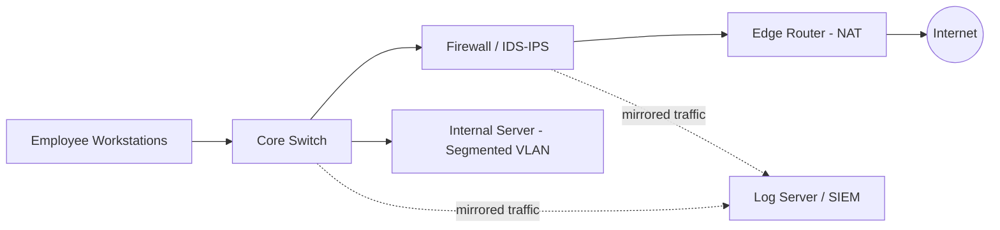

# Networking Fundamentals — Notes & Diagram

## Objective
Document core networking concepts relevant to security work, and illustrate a simple monitored network topology.

## 1. OSI Model (security-relevant view)

| Layer | Name | Example protocols | Common attack/weakness at this layer |
|-------|------|--------------------|----------------------------------------|
| 7 | Application | HTTP, DNS, FTP | SQLi, XSS, DNS spoofing |
| 6 | Presentation | SSL/TLS, encoding | Weak cipher suites, cert issues |
| 5 | Session | NetBIOS, RPC | Session hijacking |
| 4 | Transport | TCP, UDP | SYN flood, port scanning |
| 3 | Network | IP, ICMP | IP spoofing, ICMP tunneling |
| 2 | Data Link | Ethernet, ARP | ARP spoofing/poisoning |
| 1 | Physical | Cabling, NICs | Physical tapping, unauthorized access |

## 2. TCP/IP Model
- **Network Access** → **Internet (IP)** → **Transport (TCP/UDP)** → **Application**
- TCP: connection-oriented, reliable (3-way handshake: SYN → SYN-ACK → ACK). Used for HTTP(S), SSH, FTP.
- UDP: connectionless, no handshake, faster but no delivery guarantee. Used for DNS queries, VoIP, streaming.

## 3. Common Ports & Protocols

| Port | Protocol | Notes |
|------|----------|-------|
| 21 | FTP | Often unencrypted — creds visible in plaintext |
| 22 | SSH | Encrypted remote access — check for weak keys/creds |
| 23 | Telnet | Legacy, unencrypted — should not be exposed |
| 25 | SMTP | Mail transfer — watch for open relays |
| 53 | DNS | Can be abused for tunneling/exfiltration |
| 80 / 443 | HTTP / HTTPS | Web traffic — 443 should be enforced |
| 445 | SMB | File sharing — common lateral-movement target |
| 3389 | RDP | Remote desktop — frequent brute-force target |

## 4. How a Packet Moves (LAN → WAN)
1. Host builds the packet, wraps app data in TCP/UDP segment, then IP packet, then Ethernet frame.
2. Frame is sent to the default gateway (router) via the switch, resolved through ARP for the gateway's MAC address.
3. Router strips the frame, examines the IP header, and forwards the packet toward the WAN based on its routing table.
4. At the network edge, NAT translates the private IP to a public IP before the packet leaves onto the internet.
5. Return traffic is translated back and delivered to the originating host via the same path in reverse.

## 5. Topology Diagram — Small Monitored Network

**Design notes:**
- Workstations and the internal server sit on separate VLANs off the core switch to limit lateral movement.
- All traffic passing the firewall is mirrored (SPAN port) to a log server/SIEM for monitoring — this is the basis for the Week 3 monitoring dashboard work.
- The firewall/IDS-IPS sits between the internal network and the edge router, inspecting traffic before it reaches NAT and the internet.

## 6. Source / Practice
- TryHackMe: Cisco Network Fundamentals pathway (completed)
- TryHackMe: SOC Level 1 pathway (completed)
