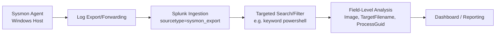

# Log-Monitoring Workflow

## Objective
Document a basic log-monitoring workflow — from raw log collection through to identifying a specific indicator — using the personal Splunk/Sysmon SOC home lab as the reference implementation.

## Workflow Stages

### Stage 1 — Collection
Sysmon is installed on the monitored Windows 10 host to capture detailed system telemetry (process creation, file creation, network connections, registry changes) beyond what default Windows Event Logs provide.

```
PS C:\Users\Muhammad Usman\Downloads\Sysmon> .\Sysmon64.exe -accepteula -i sysmonconfig-export.xml
Sysmon64 started.
PS C:\Users\Muhammad Usman\Downloads\Sysmon> Get-Service sysmon64
Status   Name               DisplayName
------   ----               -----------
Running  Sysmon64           sysmon64
```
This confirms the collection agent is installed and actively running with a custom configuration file (`sysmonconfig-export.xml`), rather than Sysmon's bare-minimum defaults.

### Stage 2 — Ingestion
Sysmon logs are exported and forwarded into Splunk as `sourcetype=sysmon_export`, making them centrally searchable rather than scattered across the local Windows Event Viewer.

```
index=main sourcetype="sysmon_export"
✓ 1,001 events (before 7/20/26 2:06:12 PM)
```
This confirms the ingestion pipeline is functioning end-to-end: logs generated on the Windows host are successfully landing in Splunk and are queryable.

### Stage 3 — Filtering / Triage
Rather than manually reviewing 1,000+ raw events, targeted searches narrow the dataset down to activity worth investigating. Example — filtering for PowerShell-related events:

```
index=main sourcetype=sysmon_export "powershell"
✓ 12 events (before 7/20/26 7:10:50 PM)
```
Narrowing from 1,001 events to 12 relevant ones is the core value of a monitoring workflow — raw log volume is not itself actionable, but a targeted, repeatable search is.

### Stage 4 — Analysis / Correlation
Each filtered event is examined for specific fields that indicate context: `Image` (what process ran), `TargetFilename` (what was created/touched), `ProcessGuid` (to correlate with related events), and `User`. This is where a raw log entry becomes an actual finding (see `../security-log-study/notes.md` for the full walkthrough of this stage against the PowerShell IOC).

### Stage 5 — Reporting / Dashboarding
Findings from repeatable searches are surfaced visually for ongoing monitoring rather than requiring a fresh manual search each time — covered in `../monitoring-dashboard/`.

## Workflow Diagram



## Sample Outputs Reference
- Collection confirmation: `screenshots/03-windows-sysmon-running.png`
- Ingestion confirmation (1,001 events): `screenshots/05-logs-confirmed.png`
- Filtered search output (12 events): see `../security-log-study/notes.md`

## Reflection
This workflow mirrors a real SOC's log pipeline at small scale: an agent generating telemetry is worthless without centralized ingestion, and centralized ingestion is unmanageable at scale without targeted, repeatable filtering. The gap identified in `../suspicious-activity-analysis/writeup.md` (missing detection evidence for the Nmap and Hydra techniques) is directly explained by this workflow — Stage 3 (targeted filtering) was only executed for the PowerShell technique, not the other two, before the lab was decommissioned. A mature monitoring workflow would define and save these targeted searches in advance for every technique being tested, rather than improvising them reactively.

## Evidence
Screenshots saved in `../screenshots/`: `03-windows-sysmon-running.png`, `05-logs-confirmed.png`.
